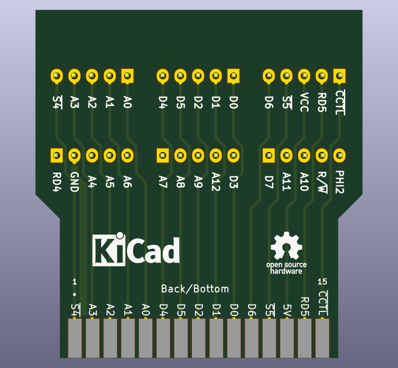
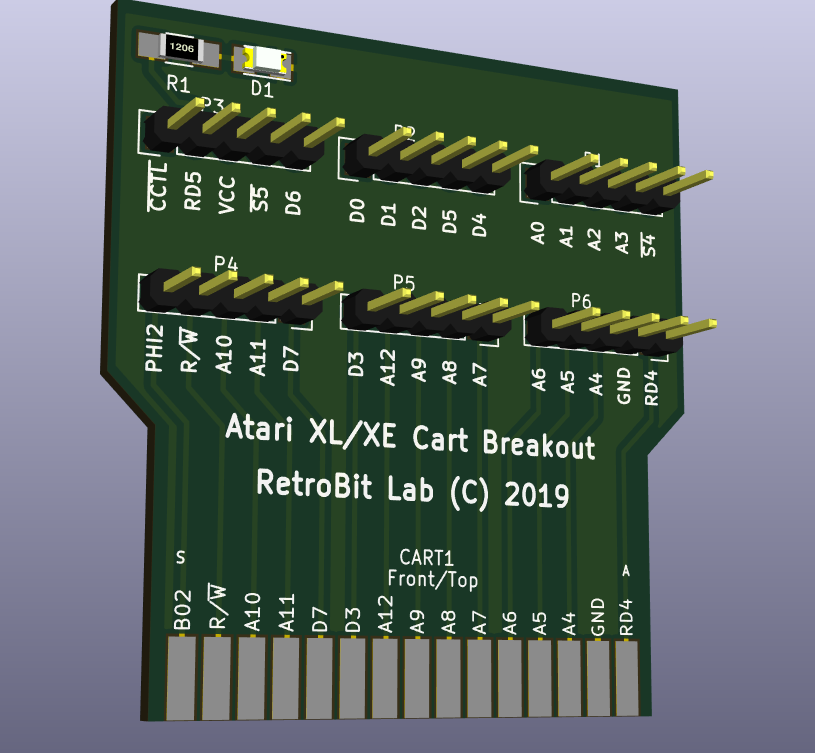

# CART-Breakout
=====================================
BreakOut Board for CART Bus Connector Atari 130XE

This is a simple cartridge breakout board, useful for many purposes developing hardware for Atari 8-bit line of computers

# Rendered Images
# 
# 
# 

Hardware License
---------------------------
Copyright (C) 2018/2019 Gianluca Renzi <gianlucarenzi@eurek.it> <icjtqr@gmail.com>

The hardware of this project is released as free/open hardware under the
GNU GPL v3 License terms. See licence.txt for details.

